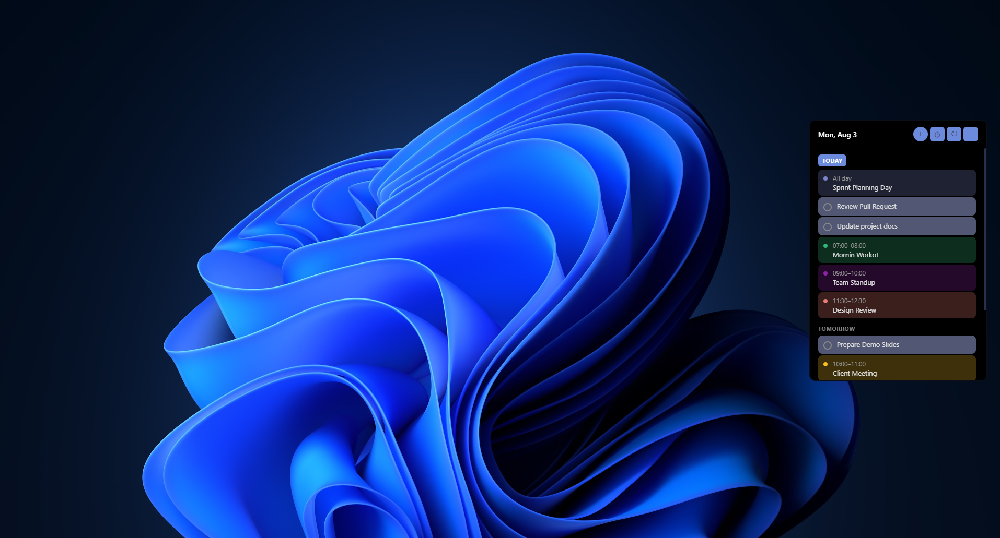
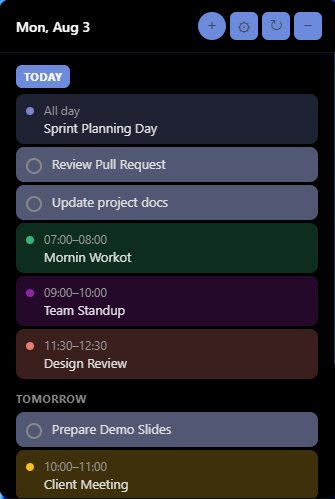
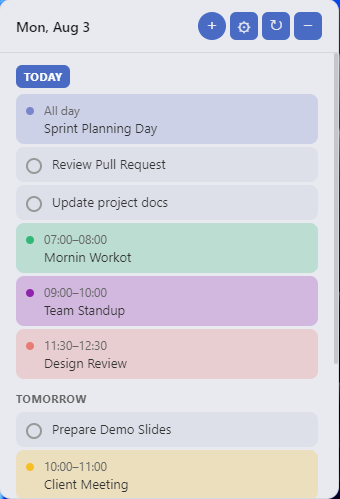
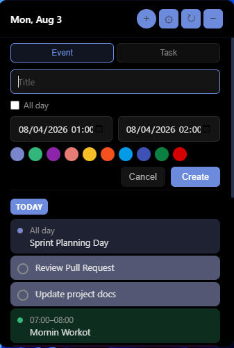
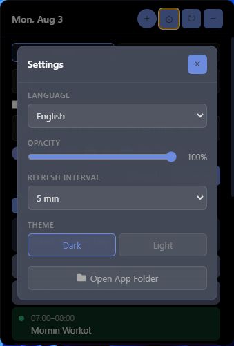
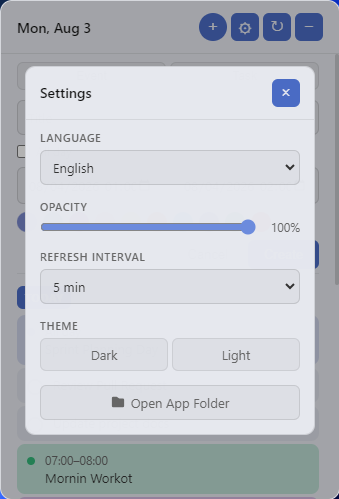
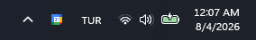

# Google Calendar Widget for Windows

A transparent, always-on-top desktop widget that displays your Google Calendar events and tasks. Drag it anywhere on your screen for quick access to your schedule.


## Screenshots



| Dark Theme | Light Theme |
|:---:|:---:|
|  |  |

| Add Event/Task | Settings (Dark) | Settings (Light) |
|:---:|:---:|:---:|
|  |  |  |

| System Tray |
|:---:|
|  |

## Features

- Semi-transparent, draggable widget (always on top)
- Dark and Light theme support
- Events and tasks from all your Google Calendars (including birthdays)
- Grouped by day (Today, Tomorrow, etc.)
- Quick creation of both events and tasks
- Complete tasks directly from the widget with a checkbox
- Click any event to open it in Google Calendar
- Adjustable opacity, refresh interval, and language (English / Turkish)
- System tray integration (show/hide, refresh, sign out, quit)
- Secure token storage using Windows DPAPI encryption
- Remembers widget position on screen
- Auto-refresh (configurable: 1, 2, 5, 10, or 15 minutes)

## Installation

### Option A: Download the Installer (Recommended)

1. Go to the [Releases](https://github.com/vedatbasboga/google-calendar-widget-windows/releases) page
2. Download the latest `Google Calendar Widget Setup x.x.x.exe`
3. Run the installer — it will install per-user (no admin required)
4. The app will launch automatically after installation

> **Note:** Windows SmartScreen may show a warning since the app is unsigned. Click **"More info"** → **"Run anyway"** to proceed.

### Option B: Build from Source

1. Clone the repository:
   ```bash
   git clone https://github.com/vedatbasboga/google-calendar-widget-windows.git
   cd google-calendar-widget-windows
   ```

2. Install dependencies:
   ```bash
   npm install
   ```

3. Run in development mode:
   ```bash
   npm start
   ```

4. Or build the installer:
   ```bash
   npm run build:win
   ```
   The installer will be created at `dist/Google Calendar Widget Setup 1.0.0.exe`.

## Google Cloud Setup (Required)

Before using the widget, you need to create Google OAuth credentials:

1. Go to [Google Cloud Console](https://console.cloud.google.com/)
2. Create a new project
3. Enable the following APIs (**APIs & Services > Library**):
   - **Google Calendar API**
   - **Google Tasks API**
4. Configure the OAuth consent screen:
   - Go to **APIs & Services > OAuth consent screen**
   - Select **External** user type
   - Fill in the app name and your email
   - Add your email as a **test user** (required while app is in "Testing" status)
5. Create OAuth 2.0 credentials:
   - Go to **APIs & Services > Credentials**
   - Click **Create Credentials > OAuth client ID**
   - Application type: **Web application**
   - Add `http://localhost:8085` to **Authorized redirect URIs**
   - Note down the **Client ID** and **Client Secret**
6. Create a `.env` file in the project root:
   ```
   GOOGLE_CLIENT_ID=your-client-id.apps.googleusercontent.com
   GOOGLE_CLIENT_SECRET=your-client-secret
   ```

## Usage

1. Launch the app and click **"Sign in with Google"**
2. A browser window will open — authorize the app with your Google account
3. Your events and tasks will appear in the widget

### Controls

| Action | How |
|--------|-----|
| Move the widget | Drag the header area |
| Add event or task | Click the **+** button |
| Refresh events | Click the refresh button |
| Hide the widget | Click the minimize button or system tray icon |
| Complete a task | Check the checkbox next to it |
| Open event in Calendar | Click on the event |
| Access settings | Click the gear icon |
| Quit the app | Right-click the system tray icon → **Quit** |

### Settings

- **Language** — English or Turkish
- **Opacity** — 50% to 100%
- **Refresh Interval** — 1, 2, 5, 10, or 15 minutes
- **Theme** — Dark or Light

## Uninstall

The app can be uninstalled from **Windows Settings > Apps > Google Calendar Widget**.

## License

MIT
